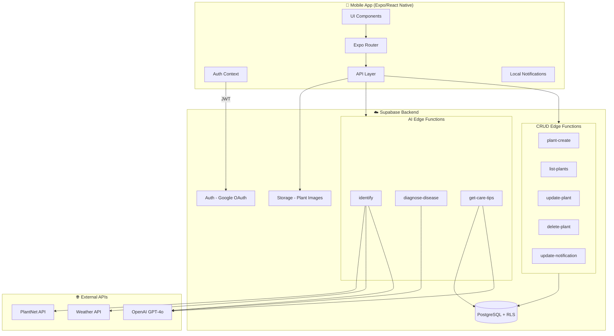
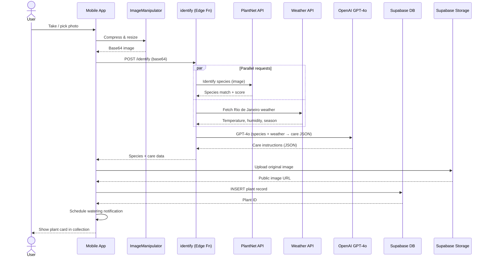
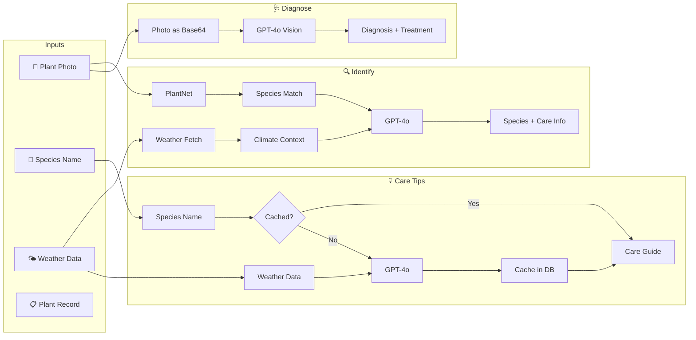

# Planticia

> Cuide das suas plantas com inteligencia artificial

## About

Planticia is a mobile plant care assistant powered by AI. Take a photo to identify any plant, diagnose diseases, and get personalized care instructions tailored to Rio de Janeiro's tropical climate.

## Features

- **Plant identification** — Snap a photo and get species info via PlantNet API
- **AI care instructions** — Personalized growing guides generated by OpenAI GPT-4o
- **Disease diagnosis** — Analyze plant health issues from photos using AI vision
- **Care tips** — Species-specific care guides, cached for quick access
- **Watering reminders** — Local push notifications so you never forget to water
- **Google OAuth** — Secure login with your Google account
- **Plant collection** — Add, view, and remove plants from your personal garden

## Tech Stack

- **Mobile**: Expo / React Native (SDK 54, React 19)
- **Backend**: Supabase (Auth, PostgreSQL, Storage, Edge Functions)
- **Plant ID**: PlantNet API
- **AI**: OpenAI GPT-4o (care info, diagnosis, tips)
- **Monorepo**: Turborepo + pnpm workspaces

## Architecture

### System Overview



### Plant Identification Flow



### AI Pipeline



## Getting Started

```bash
git clone <repo-url>
cd planticia
pnpm install
```

Copy the environment files and fill in your API keys:

```bash
cp apps/mobile/.env.example apps/mobile/.env
cp supabase/.env.example supabase/.env
```

See [SETUP.md](./SETUP.md) for full setup instructions, including Supabase configuration, building APKs, and running locally.

## Project Structure

```
planticia/
├── apps/mobile/          # Expo/React Native app
│   ├── app/              # File-based routing (Expo Router)
│   ├── components/ui/    # Reusable UI components
│   ├── libs/             # API layer (Edge Function calls)
│   └── context/          # Auth + Alert contexts
├── packages/shared/      # Shared TypeScript types
├── supabase/
│   ├── functions/        # Deno edge functions
│   └── migrations/       # PostgreSQL migrations
└── SETUP.md              # Full setup guide
```
